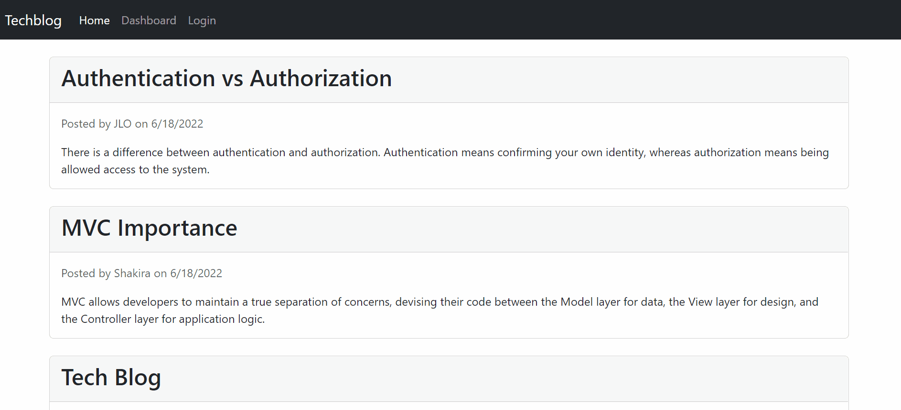

# Tech-Blog

  

  ## Description

   This is a CMS-style blog site where developers can publish their blog posts and comment on other developers’ posts as well! This app follows the MVC paradigm in its architectural structure, uses Handlebars.js as the templating language, Sequelize as the ORM, and the express-session npm package for authentication. This application is deployed using Heroku.
  
  ## Table of Contents
  
  - [Installation](#installation)
  - [Usage](#usage)
  - [Contributing](#contributing)
  - [Tests](#tests)
  - [Questions](#questions)
  - [License](#license)
  
  ## Installation
  
  No need for installation! Follow the link in the [Usage](#usage) section to view and interact with the app.
  
  ## Usage

  [Link to the Tech-Blog repository](https://github.com/cdfoye/Tech-Blog)

  [Link to the Tech-Blog Heroku application](https://frozen-castle-53172.herokuapp.com/)

  The gif below is a mock-up of the application functionality:

   
  
  ## Contributing

  If you would like to contribute to this project please reach out to me on Github or by email.
  
  ## Tests

  There are no test files in this project.

  ## Questions

  If you have any questions please visit my Github profile: [cdfoye](https://github.com/cdfoye)

  For additional questions you can email me at cdfoye@gmail.com
  
  ## License

  This application is covered under the MIT license